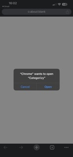
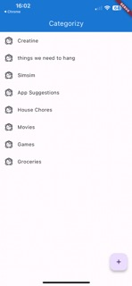

# Categorizy

A Flutter project that helps you categorize tasks and track them.

## General Info

I used [supabase](https://supabase.com/) as the database, where I utilized the [deep-link](https://supabase.com/docs/guides/getting-started/tutorials/with-flutter?database-method=sql#setup-deep-links) tutorial to add email authentication.
Example of the authentication flow:

   

Where after clicking the link in your email, you will be shown the option **"Chrome" wants to open "Categorizy"**, after clicking **Open**, you will be taken to the home screen, where you can see all the configured categories.

## Features

1. Add/Delete a **Category** from the main screen.
2. Add/Delete a **Category Item** from a specific **Category**.
3. Check/Uncheck a **Category Item**.

## Full Flow

## Getting Started With Flutter

This project is a starting point for a Flutter application.

A few resources to get you started if this is your first Flutter project:

- [Lab: Write your first Flutter app](https://docs.flutter.dev/get-started/codelab)
- [Cookbook: Useful Flutter samples](https://docs.flutter.dev/cookbook)

For help getting started with Flutter development, view the
[online documentation](https://docs.flutter.dev/), which offers tutorials,
samples, guidance on mobile development, and a full API reference.
